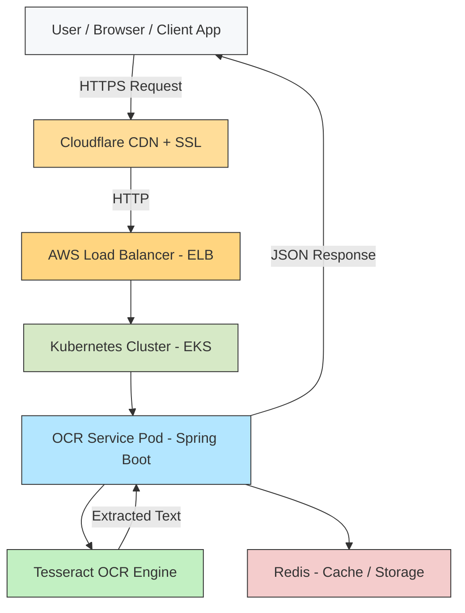

## 🏗️ OCR API - Architecture Overview

The **OCR API** is a cloud-native microservice designed to perform Optical Character Recognition (OCR) on uploaded documents or images.  
It is deployed on **Kubernetes (AWS EKS)** and exposed via an **AWS Load Balancer**, with **Cloudflare** providing DNS and HTTPS termination.

### 🔹 High-Level Architecture



### 🔹 API Usage

**URL -** https://thejavaguy.site/ocr/api/license

**Sample Response:**
```json
Response -
{
    "licenseData": {
        "maxPages": 1000,
        "expiry": "2026-12-31",
        "licenseId": "LIC-001"
    },
    "pageLimit": 1000,
    "remainingPages": 974,
    "licensed": true
}
```
