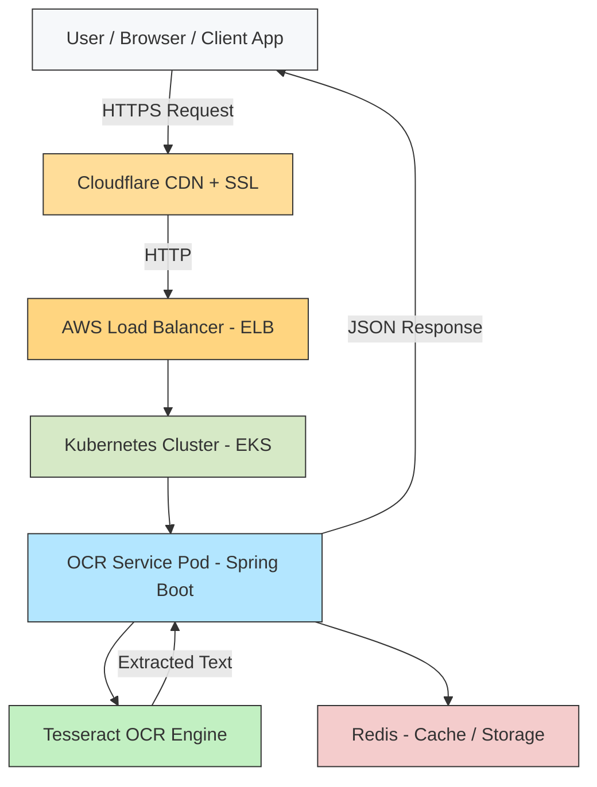

## 🏗️ OCR API - Architecture Overview

The **OCR API** is a cloud-native microservice designed to perform Optical Character Recognition (OCR) on uploaded documents or images.  
It is deployed on **Kubernetes (AWS EKS)** and exposed via an **AWS Load Balancer**, with **Cloudflare** providing DNS and HTTPS termination.

### 🔹 High-Level Architecture



### 🔹 API Usage
1. To get the license details
**GET URL -** https://thejavaguy.site/ocr/api/license

**Sample Response:**
```json
Response -
{
    "licenseData": {
        "maxPages": 1000,
        "expiry": "2026-12-31",
        "licenseId": "LIC-001"
    },
    "pageLimit": 1000,
    "remainingPages": 974,
    "licensed": true
}
```
2. To post the image
3. 
**POST URL -** https://thejavaguy.site/ocr/api/ocr

**Parameters -**

file - "@/path/to/sample-image.pdf"

ocrInputList -
```json
Request -
[
  {"label":"PROCEDURE","key":"procedure:","direction":"RIGHT","rightOf":"diagnosis:","bottomOf":"providers:"},
  {"label":"LOCATION","key":"location:","direction":"RIGHT","topOf":"procedure summary","bottomOf":"anesthesia stop:"},

  {"label":"PHYSICIANS TABLE","key":"name","direction":"BOTTOM","rightOf":"panel","topOf":"physicians","bottomOf":"staff","tableColumn":true,"keyColumn":"name"},
  {"label":"PHYSICIANS TABLE","key":"panel","direction":"BOTTOM","rightOf":"role","topOf":"physicians","bottomOf":"staff","tableColumn":true,"keyColumn":"name"},
  {"label":"PHYSICIANS TABLE","key":"role","direction":"BOTTOM","rightOf":"time period","topOf":"physicians","bottomOf":"staff","tableColumn":true,"keyColumn":"name"},
  {"label":"PHYSICIANS TABLE","key":"time period","direction":"BOTTOM","topOf":"physicians","bottomOf":"staff","tableColumn":true,"keyColumn":"name"},

  {"label":"RESPONSIBLE STAFF","key":"name","direction":"BOTTOM","rightOf":"role","topOf":"responsible staff","bottomOf":"events","tableColumn":true,"keyColumn":"name"},
  {"label":"RESPONSIBLE STAFF","key":"role","direction":"BOTTOM","rightOf":"begin","topOf":"responsible staff","bottomOf":"events","tableColumn":true,"keyColumn":"name"},
  {"label":"RESPONSIBLE STAFF","key":"begin","direction":"BOTTOM","rightOf":"end","topOf":"responsible staff","bottomOf":"events","tableColumn":true,"keyColumn":"name"},
  {"label":"RESPONSIBLE STAFF","key":"end","direction":"BOTTOM","topOf":"responsible staff","bottomOf":"events","tableColumn":true,"keyColumn":"name"}
]
```

**Sample Response:**

```json
Response -
{
    "jobId": "XXXXX-4e77-49a1-9df0-XXXXX",
    "status": "PROCESSING"
}
```

3. To get the OCR response

**GET URL -** https://thejavaguy.site/ocr/api/status/&lt;jobId&gt;

**Sample Response:**

```json
{
    "status": "COMPLETED",
    "output": {
        "LOCATION": "XX OR 09 / XXX SURGERY",
        "PROCEDURE": "Right Robotic Video Assisted Thoracoscopy Lung Resection with Lymph Nodule Dissection. (Right: Chest)",
        "RESPONSIBLE STAFF": [
            {
                "Name": "XXXX",
                "Role": "ANESTH",
                "Begin": "0737",
                "End": "1123"
            },
            {
                "Name": "XXXX",
                "Role": "CRNA",
                "Begin": "0737",
                "End": "0829"
            },
            {
                "Name": "XXXX",
                "Role": "CRNA",
                "Begin": "0829",
                "End": "0845"
            },
            {
                "Name": "XXXX",
                "Role": "CRNA",
                "Begin": "0845",
                "End": "1123"
            }
        ],
        "PHYSICIANS TABLE": [
            {
                "Name": "XXX",
                "Panel": "Panel 1",
                "Role": "Primary",
                "Time Period": "8/12/2025 0739 - 8/12/2025 1114"
            },
            {
                "Name": "XXXX",
                "Panel": "Panel 1",
                "Role": "Assisting",
                "Time Period": "8/12/2025 0739 - 8/12/2025 1114"
            },
            {
                "Name": "XXXX",
                "Panel": "Panel 1",
                "Role": "Resident - Assisting",
                "Time Period": "8/12/2025 0739 - 8/12/2025 1114"
            }
        ]
    },
    "timeTakenInMinutes": 3.4718333333333335
}
```
